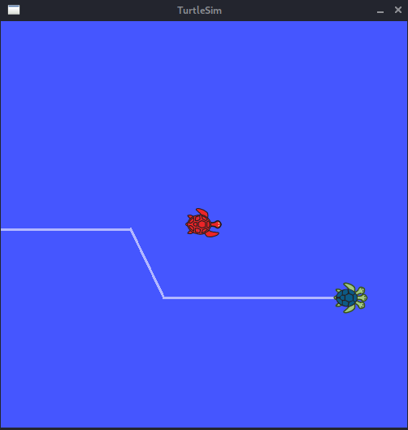

# TurtleSim maneuver

## Running the program

First source the setup using the following command (I use `zsh`, thus the file `setup.zsh`, choose your file accordingly)
```
source devel/setup.zsh
```

Then run the program using
```
rosrun maneuver maneuver
```

## Example trajectories

I have tried to make the program quite general. The only assumptions that I have made is that the moving turtle starts with *theta = 0*. Few of the test cases, as seen on my machine, are depicted below


*This was the default test case given in the problem set.*
<br></br>


