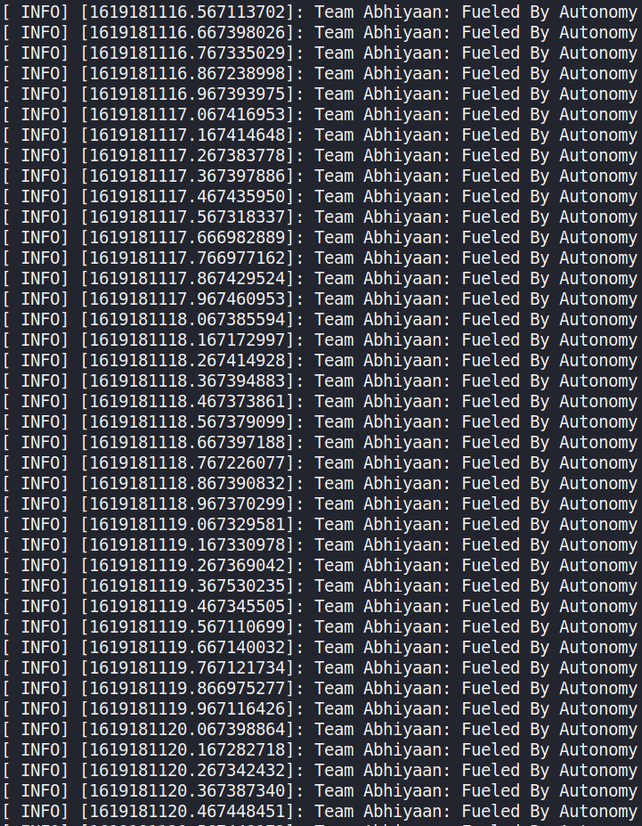

# Nodes

## Running the program

This program consists of three different nodes, and thus requires three terminals to run. So open three terminals, and  source the setup using the following command in each of the terminals(I use `zsh`, thus the file `setup.zsh`, choose your file accordingly)
```
source devel/setup.zsh
```

Now, in the first terminal, run
```
rosrun nodes node1
```

In the second one, run
```
rosrun nodes node2
```

And in the last one, run
```
rosrun nodes node3
```

The last node is the subscriber node, and the first two are publisher nodes. Therefore, you will see the concatenated message being printed in the last terminal.

## Example

The following screenshot shows how the concatenated message will look like in the shell



Press <kbd>Ctrl</kbd> + <kbd>C</kbd> to stop the process.