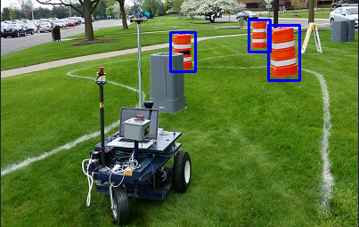
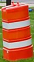

# OpenCV

## Programs

This directory contains two programs, one in `igvc_track` and the other in `pedestrians`.

## IGVC Track

To run this program, go to the `igvc_track` subdirectory, and run it by the following command
```
python3 bound_box.py
```

### Output

The output image looks like this



Press <kbd>ESC</kbd> to close the window and the program.

### Clarifications

I have used *histogram backprojection* (as suggested in the problem set) to achieve this. The sample image of an obstacle, which I used for the program, is below



<br></br>

## Pedestrians

To run this program, go to the `pedestrians` subdrectory, and run it by the following command
```
python3 track_pedestrians.py
```

### Output

The output is a video, however, below is one of the frames of the video


Press <kbd>ESC</kbd> to close the window and the program.

### Clarifications

I have used *Haar Cascades* (an built-in classifier of OpenCV) to detect the full-body of a pedestrian.
